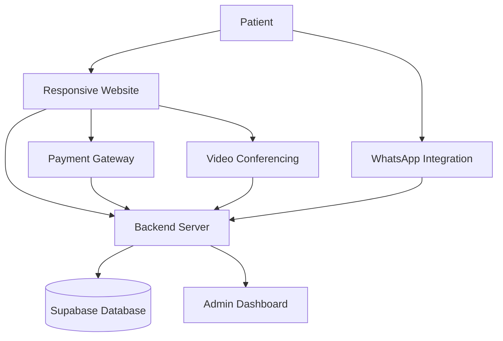
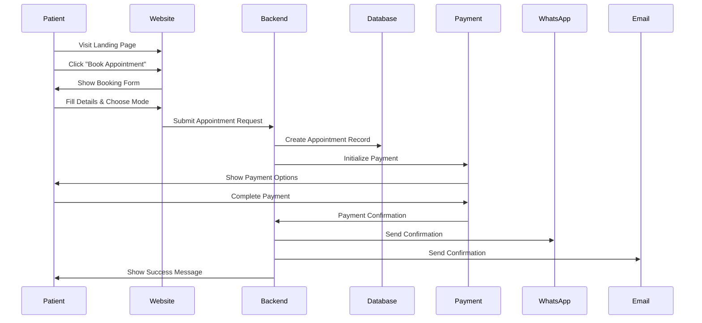
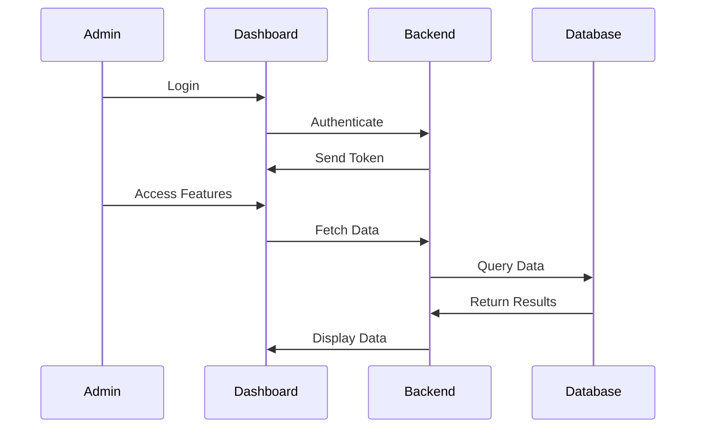
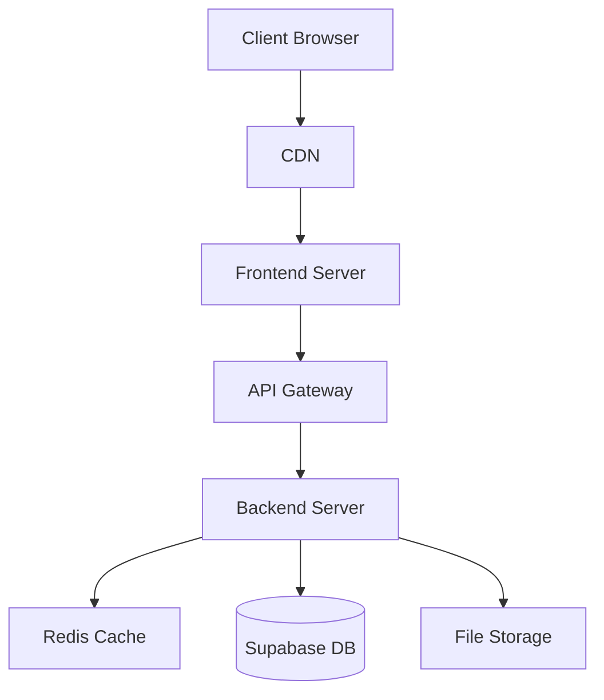

# Healthcare Clinic System Architecture

## System Overview

## Technology Stack

### Frontend
- React with TypeScript
- Vite for build tooling
- TailwindCSS for styling
- React Router for navigation
- Stripe & Razorpay for payments

### Backend
- Node.js with Express
- Supabase for database
- JWT for authentication
- Nodemailer for email notifications
- WhatsApp Business API integration

### Infrastructure
- Supabase for database and authentication
- WebRTC for video consultations
- Stripe & Razorpay payment gateways
- SMTP for email notifications

## Core Workflows

### 1. Patient Appointment Booking

### 2. Admin Dashboard Flow

## Key Components

### 1. Patient Portal
- Landing page with service information
- Appointment booking system
- Payment integration
- Video consultation interface
- Appointment history

### 2. Admin Dashboard
- Authentication system
- Patient management
- Appointment management
- Payment tracking
- Report generation
- Video consultation management

### 3. Backend Services
- RESTful API endpoints
- Authentication & authorization
- Payment processing
- WhatsApp notifications
- Email notifications
- Video call signaling

### 4. Database Schema
- Patients table
- Appointments table
- Payments table
- Admin users table
- Medical records

## Security Measures

1. **Authentication**
   - JWT-based authentication
   - Role-based access control
   - Secure password hashing

2. **Data Protection**
   - HTTPS encryption
   - Secure payment processing
   - Database encryption
   - Input validation

3. **API Security**
   - Rate limiting
   - CORS configuration
   - Request validation
   - Error handling

## Integration Points

### 1. Payment Gateways
- Stripe integration
- Razorpay integration
- Payment webhook handling
- Transaction logging

### 2. Communication
- WhatsApp Business API
- Email notifications
- Video conferencing
- Real-time updates

### 3. External Services
- SMS gateway
- Video conferencing API
- Payment processors
- Cloud storage

## Deployment Architecture

## Scalability Considerations

1. **Horizontal Scaling**
   - Stateless backend design
   - Load balancing
   - Database optimization

2. **Performance**
   - CDN integration
   - Caching strategies
   - Database indexing
   - Query optimization

3. **Monitoring**
   - Error tracking
   - Performance metrics
   - User analytics
   - System health checks 